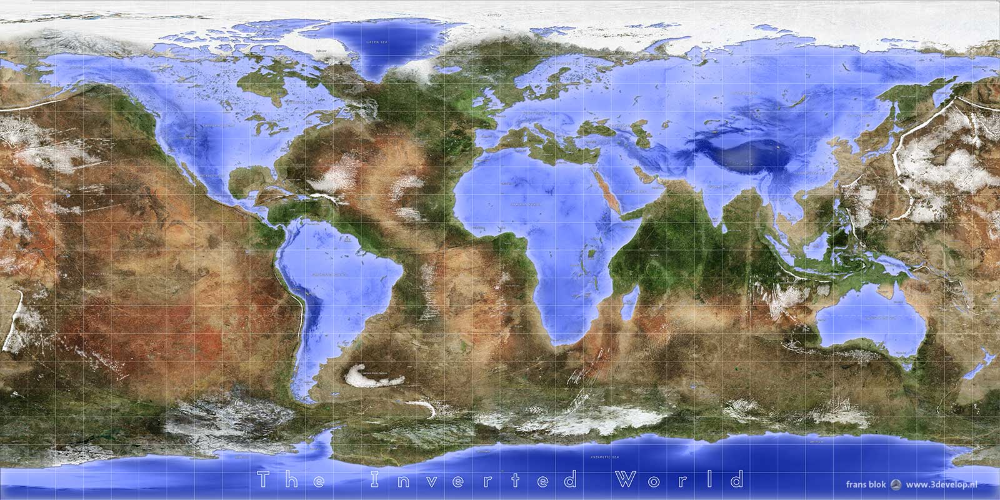
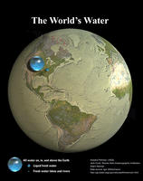

Recently interesting world maps with variations have been doing the rounds. 
Thought provoking new perspectives:

[The Inverted World Map - Variations on a Blue Marble - 3Develop image blog](http://www.3develop.nl/blog/inverted-world-map-blue-marble/)

Reminds me of the images from a few years ago now showing how little water is on the surface compared to the size of the planet:

[All of Earth's Water in a single sphere!](https://www.usgs.gov/media/images/all-earths-water-a-single-sphere)

